<picture>
  <source media="(prefers-color-scheme: dark)" srcset="./assets/profile-system-dark.svg">
  <source media="(prefers-color-scheme: light)" srcset="./assets/profile-system-light.svg">
  
</picture>

  AI engineering across agents, verification, computer vision, and robotics.

<picture>
  <source media="(prefers-color-scheme: dark)" srcset="./assets/proof-strip-dark.svg">
  <source media="(prefers-color-scheme: light)" srcset="./assets/proof-strip-light.svg">
  
</picture>

 

<picture>
  <source media="(prefers-color-scheme: dark)" srcset="https://raw.githubusercontent.com/Jeevang1-epic/Jeevang1-epic/output/github-contribution-grid-snake-dark.svg">
  <source media="(prefers-color-scheme: light)" srcset="https://raw.githubusercontent.com/Jeevang1-epic/Jeevang1-epic/output/github-contribution-grid-snake.svg">
  
</picture>

## Selected systems

| Project | What it demonstrates |
| --- | --- |
| **[AgentForge QA](https://github.com/Jeevang1-epic/agentforge-qa)** | Local-first CLI that checks coding-agent claims against commands, artifacts, Git state, and typed evidence. |
| **[JdeRobot / ROS 2](https://github.com/Jeevang1-epic/JdeRobot-GSoC26-ROS2-F1-G1)** | Monocular behavioral cloning with ROS 2 control interfaces for autonomous racing. |
| **[DeepLense / ML4Sci](https://github.com/Jeevang1-epic/ML4Sci-DeepLense-GSoC-Jeevan)** | PyTorch pipelines for gravitational-lensing classification, localization, and reproducible evaluation. |
| **[AgentForge TestPilot](https://github.com/Jeevang1-epic/AgentForge-TestPilot)** | Deterministic release governance for agent-assisted enterprise automations. |
| **[Desert-Net](https://github.com/Jeevang1-epic/Desert-Net-Offroad-Segmentation)** | DINOv2-based semantic segmentation for off-road rover perception. |
| **[Real-time fire detection](https://github.com/Jeevang1-epic/Real-time-fire-detection-YOLO-ViT-CNN-vs-RTDETR_G1)** | Controlled YOLOv8 vs. RT-DETR study for fire and smoke detection. |

## Open source

**20+ external OSS PRs merged.** Recent upstream work includes correctness and edge-case fixes across [Kornia](https://github.com/kornia/kornia/pulls?q=is%3Apr+author%3AJeevang1-epic+is%3Amerged) and a [local-model cache isolation fix](https://github.com/huggingface/transformers/pull/45642) in Hugging Face Transformers.

## Focused capabilities

| AI systems | Vision & ML | Robotics |
| --- | --- | --- |
| Agent orchestration · verification · model evaluation | PyTorch · deep learning · detection · segmentation | ROS 2 · simulation · autonomous systems · perception |

**Languages:** Python — primary · TypeScript / JavaScript — strong · C++ — working 
**Systems:** Git / GitHub Actions · Vercel · Linux / WSL · local-first developer tooling

## Connect

  <a href="https://github.com/Jeevang1-epic">GitHub</a>
  &nbsp;·&nbsp;
  <a href="https://www.linkedin.com/in/puttala-jeevan-kumar">LinkedIn</a>
  &nbsp;·&nbsp;
  <a href="https://x.com/Jeevan14645371">X</a>

